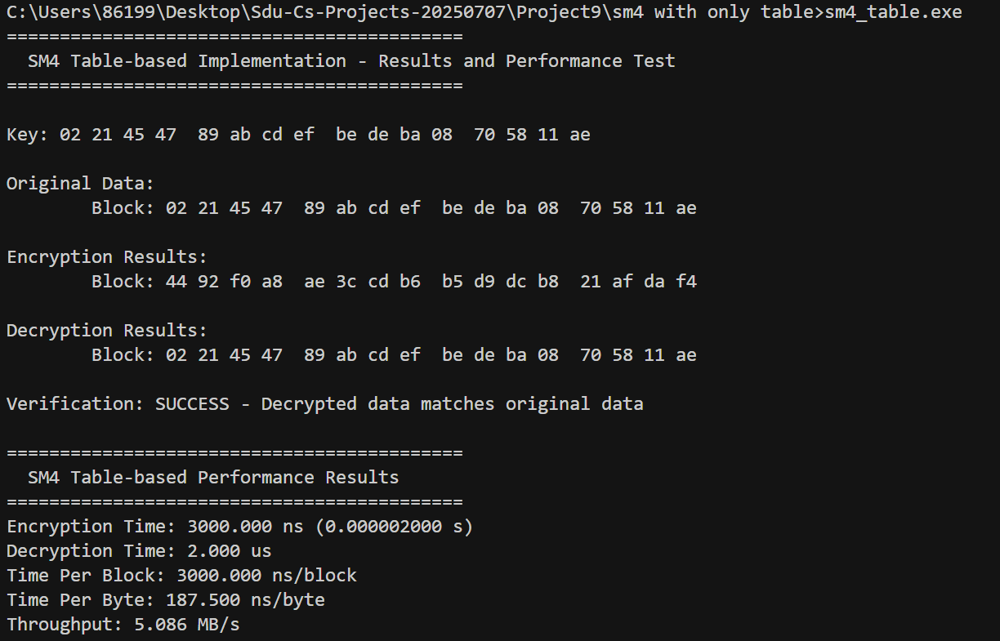
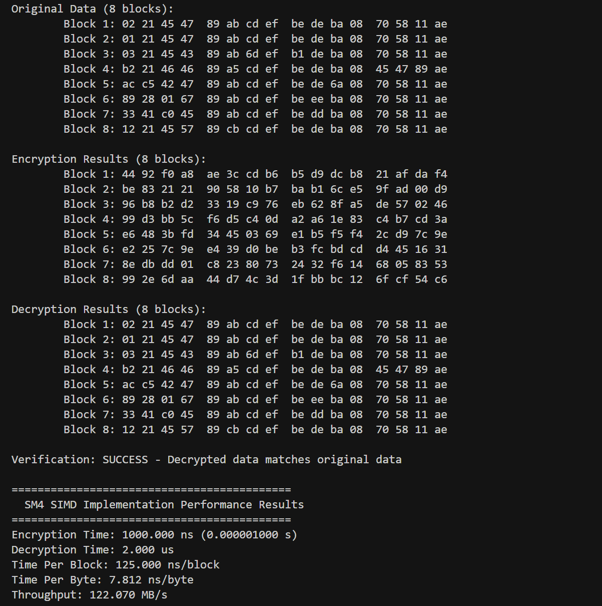
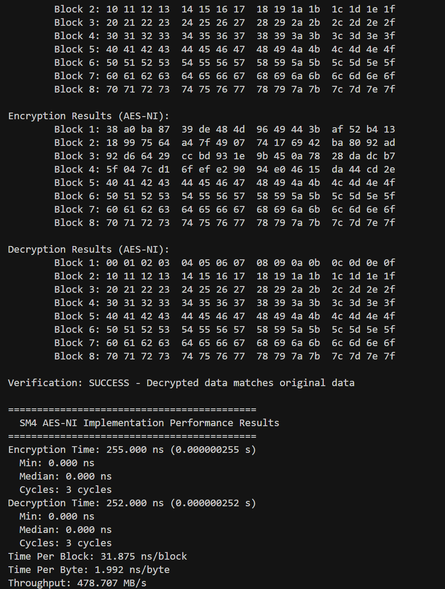

# SM4加密算法的软件优化实现

本项目实现了SM4加密算法的三种软件优化加速方法，通过不同的优化技术大幅提高SM4算法的执行效率。

## 实现方法概述

共完成三种实现方法：

1. **基础查找表优化**：使用预计算的查找表加速S盒操作
2. **SIMD指令集优化**：利用AVX2指令集并行处理多个数据块
3. **AES-NI指令集优化**：借助Intel AES-NI指令集加速S盒操作

## 基础查找表优化设计

查找表优化是最基本的加速方法，通过预计算S盒变换结果并存储在查找表中，将运行时的复杂计算转换为简单的表查找操作。

- 实现了4个32位查找表，每个表对应S盒变换后的不同字节位置
- 每次查表操作可直接获得完整的32位变换结果
- 单线程处理单个数据块

## SIMD指令集优化设计

SIMD (Single Instruction Multiple Data) 优化利用现代CPU的向量处理能力，同时处理多个数据块。

- 使用AVX2指令集，可同时处理256位数据
- 实现了8个数据块的并行加解密
- 通过向量化操作减少指令数量和CPU周期
- 显著提高吞吐量，特别适合批量数据处理

## AES-NI指令集优化设计

基本思想是利用SM4与AES中S盒结构的相似性，借助Intel的AES-NI指令完成S盒操作。

- 使用`_mm_aesenclast_si128`指令执行S盒替换
- 通过特殊处理消除AES指令中的行移位和轮密钥加操作的影响
- 将4组SM4消息打包处理，充分利用128位AES-NI指令
- 实现了8个数据块的并行处理

值得注意的是，AES-NI只能处理128位数据，在理论上处理宽度小于可处理256位的AVX2，但由于是专用硬件加速，实际性能表现优异。

## 性能测试与比较

### 1. 基础查找表实现

基础实现处理单个数据块，性能表现如下：

### 2. SIMD AVX2实现

SIMD实现可同时处理8个数据块，显著提高吞吐量：

### 3. AES-NI指令集实现

AES-NI实现利用专用硬件加速，性能最优：

## 性能对比分析

三种实现方法的性能比较：

| 实现方法 | 单块处理时间 | 吞吐量 | 特点 |
|---------|------------|-------|------|
| 基础查找表 | 较高 | 较低 | 实现简单，适用性广 |
| SIMD AVX2 | 中等 | 高 | 并行处理多块，需要AVX2支持 |
| AES-NI | 最低 | 最高 | 硬件加速，需要Intel CPU支持AES-NI |

## 结论

1. AES-NI实现性能最优，但对硬件有特定要求
2. SIMD实现在支持AVX2的平台上提供良好的性能提升
3. 基础查找表实现兼容性最好，但性能相对较低

通过这三种实现方法的比较，可以看出利用现代CPU特性可以显著提升密码算法的软件实现效率。根据实际应用场景和硬件条件，可以选择最合适的实现方法。