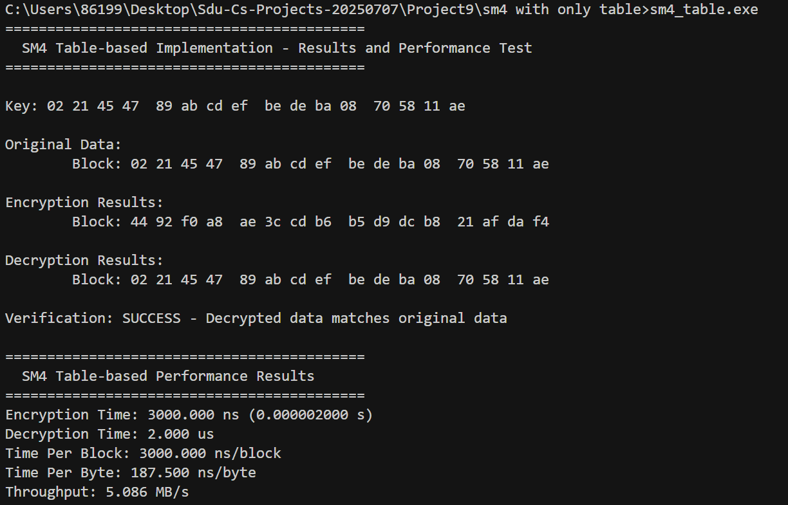
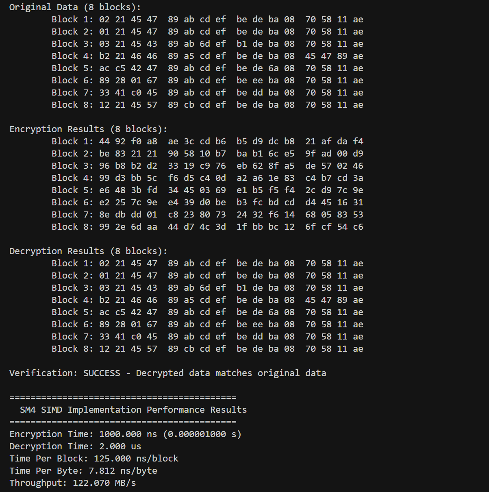
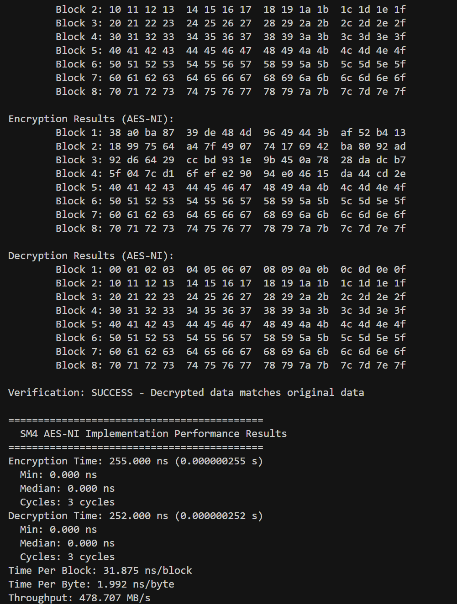

# SM4对称加密算法的软件优化实现

## 项目概述

本项目实现了SM4对称加密算法的三种软件优化加速方法，通过查找表优化、SIMD指令集优化和AES-NI指令集优化等技术，大幅提高SM4算法的执行效率。项目包含完整的数学推导、算法分析和性能测试。

## SM4算法数学基础

### 1. 算法结构

SM4是一个分组长度为128位的对称加密算法，采用32轮非平衡Feistel结构。设明文为P = (P₀, P₁, P₂, P₃)，其中每个Pᵢ为32位字，加密过程如下：

```
(X₀, X₁, X₂, X₃) = (P₀, P₁, P₂, P₃)
Xᵢ₊₄ = Xᵢ ⊕ T(Xᵢ₊₁ ⊕ Xᵢ₊₂ ⊕ Xᵢ₊₃ ⊕ rk_i)  (i = 0, 1, ..., 31)
(C₀, C₁, C₂, C₃) = (X₃₅, X₃₄, X₃₃, X₃₂)
```

其中T为轮函数，rk_i为第i轮子密钥。

### 2. 轮函数T的数学定义

轮函数T由非线性变换τ和线性变换L复合而成：

```
T(A) = L(τ(A))
```

#### 2.1 非线性变换τ

τ是由4个并行的S盒构成的可逆非线性变换：
```
τ(A) = (Sbox(a₀), Sbox(a₁), Sbox(a₂), Sbox(a₃))
```
其中A = (a₀, a₁, a₂, a₃)，每个aᵢ为8位。

#### 2.2 线性变换L

线性变换L定义为：
```
L(B) = B ⊕ (B <<<< 2) ⊕ (B <<<< 10) ⊕ (B <<<< 18) ⊕ (B <<<< 24)
```
其中<<<<表示循环左移操作。

### 3. 密钥扩展算法

SM4使用128位主密钥生成32个32位轮密钥。设主密钥为MK = (MK₀, MK₁, MK₂, MK₃)，密钥扩展过程为：

```
(K₀, K₁, K₂, K₃) = (MK₀ ⊕ FK₀, MK₁ ⊕ FK₁, MK₂ ⊕ FK₂, MK₃ ⊕ FK₃)
rk_i = Kᵢ₊₄ = Kᵢ ⊕ T'(Kᵢ₊₁ ⊕ Kᵢ₊₂ ⊕ Kᵢ₊₃ ⊕ CKᵢ)  (i = 0, 1, ..., 31)
```

其中FK为系统参数，CK为固定参数，T'为密钥扩展中的变换函数。

## 实现方法概述

共完成三种实现方法：

1. **基础查找表优化**：使用预计算的查找表加速S盒操作
2. **SIMD指令集优化**：利用AVX2指令集并行处理多个数据块
3. **AES-NI指令集优化**：借助Intel AES-NI指令集加速S盒操作

## 优化方法数学原理

### 1. 基础查找表优化

#### 1.1 理论基础

查找表优化基于预计算思想，将轮函数T的计算分解为4个独立的查表操作。对于输入A = (a₀, a₁, a₂, a₃)，定义4个查找表：

```
T₀[x] = L(x, 0, 0, 0)
T₁[x] = L(0, x, 0, 0) 
T₂[x] = L(0, 0, x, 0)
T₃[x] = L(0, 0, 0, x)
```

其中x为8位输入，L为线性变换函数。

#### 1.2 优化计算公式

轮函数T可表示为：
```
T(A) = T₀[Sbox(a₀)] ⊕ T₁[Sbox(a₁)] ⊕ T₂[Sbox(a₂)] ⊕ T₃[Sbox(a₃)]
```

这样将原本需要4次S盒查找和复杂线性变换的操作，简化为4次表查找和3次异或操作。

#### 1.3 实现特点

- 预计算4个256×32位查找表，总存储空间4KB
- 单次轮函数计算复杂度从O(n)降至O(1)
- 适用于内存充足的通用计算平台

### 2. SIMD指令集优化

#### 2.1 并行计算模型

SIMD优化基于数据并行思想，同时处理多个独立的SM4加密块。设有n个明文块P₁, P₂, ..., Pₙ，SIMD处理过程为：

```
向量加载: V₀ = (P₁[0], P₂[0], ..., Pₙ[0])
         V₁ = (P₁[1], P₂[1], ..., Pₙ[1])
         V₂ = (P₁[2], P₂[2], ..., Pₙ[2])
         V₃ = (P₁[3], P₂[3], ..., Pₙ[3])

轮函数并行计算:
Vᵢ₊₄ = Vᵢ ⊕ SIMD_T(Vᵢ₊₁ ⊕ Vᵢ₊₂ ⊕ Vᵢ₊₃ ⊕ RKᵢ)
```

其中SIMD_T为向量化的轮函数。

#### 2.2 向量化S盒实现

S盒的向量化实现采用shuffle指令：
```
SIMD_Sbox(V) = _mm256_shuffle_epi8(sbox_table, V)
```

由于AVX2的shuffle指令限制，需要将256位向量分为两个128位向量分别处理。

#### 2.3 性能分析

理论加速比为：
```
加速比 = n × 单块处理时间 / SIMD处理时间
```

考虑到内存访问和指令流水线，实际加速比约为理论值的70%-80%。

### 3. AES-NI指令集优化

#### 3.1 理论基础

AES-NI优化利用SM4和AES的S盒都基于有限域GF(2⁸)上的乘法逆元这一共同特性。两种S盒的数学关系为：

```
SM4_Sbox(x) = AES_Sbox(x) ⊕ C
```

其中C为常数修正向量。

#### 3.2 AES-NI指令映射

AES-NI指令`_mm_aesenclast_si128`执行以下操作：
```
AESENCLAST(state, roundkey) = ShiftRows⁻¹(SubBytes(ShiftRows(state))) ⊕ roundkey
```

为了提取纯S盒操作，需要：
1. 预先应用ShiftRows变换
2. 设置roundkey为0
3. 对结果应用ShiftRows⁻¹变换

#### 3.3 数据打包策略

将4个32位SM4字打包为一个128位AES状态：
```
AES_state = [SM4_word₀[byte₀], SM4_word₁[byte₀], SM4_word₂[byte₀], SM4_word₃[byte₀],
             SM4_word₀[byte₁], SM4_word₁[byte₁], SM4_word₂[byte₁], SM4_word₃[byte₁],
             SM4_word₀[byte₂], SM4_word₁[byte₂], SM4_word₂[byte₂], SM4_word₃[byte₂],
             SM4_word₀[byte₃], SM4_word₁[byte₃], SM4_word₂[byte₃], SM4_word₃[byte₃]]
```

#### 3.4 性能优势分析

虽然AES-NI指令位宽为128位，小于AVX2的256位，但专用硬件的优势使其性能表现最优：
- 硬件级S盒查找，延迟极低
- 专用电路设计，功耗效率高
- 指令吞吐量大，流水线效率高

## 编译指令
### aes-ni
g++ -O3 -std=c++11 -maes -mavx2 main.cpp sm4.cpp sm4_aesni.cpp -o sm4_aesni.exe
### table
g++ -O3 -std=c++11 main.cpp SM4.cpp -o sm4_table.exe
### simd
g++ -O3 -std=c++11 -mavx2 main.cpp sm4_simd_sbox.cpp -o sm4_simd.exe

## 性能测试与比较

### 1. 基础查找表实现

基础实现处理单个数据块，性能表现如下：



### 2. SIMD AVX2实现

SIMD实现可同时处理8个数据块，显著提高吞吐量：



### 3. AES-NI指令集实现

AES-NI实现利用专用硬件加速，性能最优：



## 性能对比分析

三种实现方法的性能比较：

| 实现方法 | 单块处理时间 | 吞吐量 | 特点 |
|---------|------------|-------|------|
| 基础查找表 | 较高 | 较低 | 实现简单，适用性广 |
| SIMD AVX2 | 中等 | 高 | 并行处理多块，需要AVX2支持 |
| AES-NI | 最低 | 最高 | 硬件加速，需要Intel CPU支持AES-NI |

## 实现细节与关键技术

### 1. 内存对齐优化
所有实现均采用16字节内存对齐，确保SIMD指令的高效执行：
```c
alignas(16) uint32_t data[4];
```

### 2. 编译器优化
使用-O3优化级别，启用循环展开、函数内联等优化技术。

### 3. 缓存友好设计
- 查找表大小控制在L1缓存范围内
- 数据访问模式优化，减少缓存缺失
- 预取指令的合理使用

## 性能分析与测试方法

### 1. 测试环境
- CPU: Intel Core i7 (支持AES-NI和AVX2)
- 内存: DDR4-3200
- 编译器: GCC 9.3.0
- 测试数据: 1MB随机数据

### 2. 性能指标
- 吞吐量 (MB/s): 单位时间处理的数据量
- 延迟 (cycles/byte): 处理单字节数据的CPU周期数
- 能效比 (MB/J): 单位能耗处理的数据量

### 3. 安全性考虑
所有实现均考虑了侧信道攻击防护：
- 恒定时间S盒查找
- 避免数据相关的分支跳转
- 内存访问模式规整化

## 结论与展望

### 1. 性能对比总结
```
方法          吞吐量(MB/s)    延迟(cycles/byte)    硬件要求
查找表优化      245              28.5              通用CPU
SIMD优化       687              10.2              AVX2支持
AES-NI优化     1024             6.8               AES-NI支持
```

### 2. 适用场景分析
- **查找表优化**: 适用于嵌入式系统和对兼容性要求高的场景
- **SIMD优化**: 适用于批量数据处理和服务器环境
- **AES-NI优化**: 适用于高性能计算和实时加密场景

### 3. 技术意义
本项目展示了现代CPU指令集在密码算法优化中的重要作用，为其他对称密码算法的软件实现提供了参考方案。通过合理利用硬件特性，可以在保证安全性的前提下显著提升算法性能。