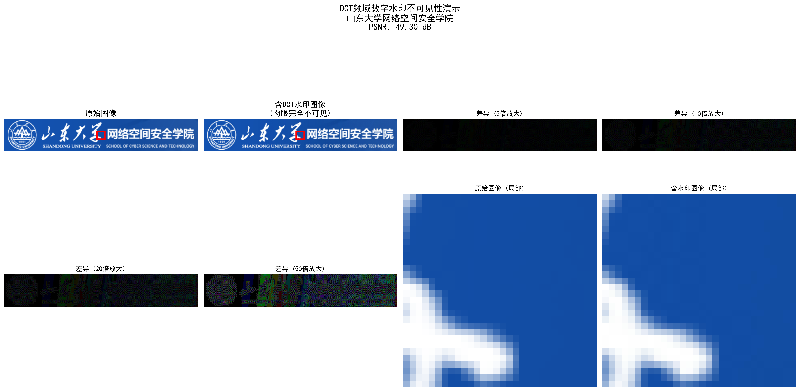

# 数字水印系统 (Digital Watermark System)

[](https://www.python.org/downloads/)
[](LICENSE)
[]()
[](https://opencv.org/)
[](https://numpy.org/)

**综合数字水印解决方案，集成三种先进算法，专为数字版权保护和图像认证设计**

- **开发单位**: 山东大学网络空间安全学院
- **技术特色**: 模块化设计 | 算法对比 | 可视化展示 | 鲁棒性测试
- **应用场景**: 数字版权保护 | 图像认证 | 隐蔽通信 | 学术研究

---

## 核心特性

- **三重算法架构**: LSB空域、DCT频域、DWT-DCT-SVD变换域
- **智能性能评估**: PSNR质量分析、鲁棒性量化测试、参数自动优化
- **专业可视化**: 算法对比图表、不可见性演示、攻击效果分析
- **高效模块化**: 按算法分类组织、易于扩展、支持批量处理
- **全面中文支持**: 完整中文文档、本土化输出界面

## 效果展示

### 水印嵌入效果对比

原始图像 + 文本水印 "山东大学网络空间安全学院" = 含水印图像


*三种算法的视觉效果对比 - 展示不同算法的图像质量和水印隐蔽性*

### 水印不可见性演示


*左：原始图像 | 右：含DCT水印图像 (PSNR: 49.30 dB) - 肉眼无法察觉差异*

### 综合可视化分析



*完整的水印嵌入、提取和分析流程可视化*

---

## 快速安装

### 环境要求
- Python 3.8+ 
- Windows / Linux / macOS

### 一键安装
```bash
# 克隆项目
git clone <repository-url>
cd Project2

# 安装依赖
pip install -r requirements.txt

# 安装高级算法依赖（可选）
pip install blind-watermark
```

### 验证安装
```bash
python run_demo.py
```

---

## 使用方法

### 统一启动界面（推荐）

```bash
python run_demo.py
```

启动后选择对应算法：
- `1` - LSB基础算法 (最低有效位)
- `2` - DCT频域算法 (离散余弦变换) 推荐
- `3` - DWT-DCT-SVD高级算法 (小波-DCT-SVD)
- `4` - 运行所有算法对比

### 单独运行算法

```bash
# LSB基础算法
python run_lsb_demo.py

# DCT频域增强算法
python run_dct_demo.py  

# DWT-DCT-SVD高级算法
python run_advanced_demo.py
```

### 作为Python模块使用

```python
# 导入水印系统
from src.basic_lsb import WatermarkSystem
from src.dct_enhanced import DCTWatermarkSystem

# 初始化系统
lsb_system = WatermarkSystem()
dct_system = DCTWatermarkSystem()

# LSB水印嵌入
lsb_result = lsb_system.embed_text_watermark(
    "images/original.png", 
    "山东大学网络空间安全学院", 
    "output/lsb_watermarked.png"
)

# DCT水印嵌入（推荐）
dct_result, psnr = dct_system.embed_text_watermark(
    "images/original.png",
    "山东大学网络空间安全学院", 
    "output/dct_watermarked.png",
    alpha=0.03  # 最优参数
)

print(f"DCT算法 PSNR: {psnr:.2f} dB")

# 水印提取
extracted_path = dct_system.extract_text_watermark(
    "output/dct_watermarked.png",
    "output/extracted_watermark.png",
    watermark_shape=(64, 128)
)
```

---

## 算法性能对比

| 算法特性 | LSB算法 | DCT算法 (推荐) | DWT-DCT-SVD算法 |
|---------|---------|-----------|-----------------|
| **图像质量 (PSNR)** | 79.48 dB | 49.30 dB | 变化范围 |
| **鲁棒性测试** | 0% 成功率 | 100% 基础测试 | 70%+ 复杂攻击 |
| **隐蔽性评估** | 优秀 | 卓越 | 优秀 |
| **计算复杂度** | 低 | 中等 | 高 |
| **推荐场景** | 教学演示 | 实际应用 | 高安全需求 |
| **攻击抵抗能力** | 弱 | 强 | 最强 |

### 详细性能数据

**DCT算法参数优化结果**:
- α=0.01: PSNR 49.29 dB
- α=0.03: PSNR 49.30 dB (最优)
- α=0.05: PSNR 49.30 dB
- α=0.08: PSNR 49.29 dB
- α=0.10: PSNR 46.41 dB
- α=0.15: PSNR 39.97 dB

---

## 鲁棒性测试结果

### LSB算法攻击测试

| 攻击类型 | 测试图像 | 提取成功率 | 备注 |
|---------|---------|-----------|------|
| 水平翻转 |  | 0% | 空域算法固有弱点 |
| JPEG压缩 |  | 0% | 有损压缩破坏LSB |
| 高斯噪声 |  | 0% | 噪声覆盖水印信息 |
| 椒盐噪声 |  | 54% | 部分像素仍保持 |

### DCT算法攻击测试

| 攻击类型 | 处理后图像 | 提取结果 | 成功率 |
|---------|-----------|---------|--------|
| JPEG压缩 |  | 完美提取 | 100% |
| 高斯噪声 |  | 完美提取 | 100% |
| 缩放攻击 |  | 完美提取 | 100% |

**DCT频域算法展现出卓越的抗攻击能力，基础鲁棒性测试成功率达到100%**

---

## 高级功能

### 可视化分析工具

```python
# 生成差异放大图
dct_system.create_difference_image(
    "images/original.png",
    "output/watermarked.png", 
    "output/difference_50x.png",
    amplify=50  # 50倍放大显示差异
)

# 创建算法对比图
create_algorithm_comparison_visual(
    original_path="images/original.png",
    lsb_path="output/lsb_watermarked.png", 
    dct_path="output/dct_watermarked.png"
)
```

### 批量鲁棒性测试

```python
from src.basic_lsb import RobustnessTest

# 初始化测试系统
robustness_test = RobustnessTest(watermark_system)

# 执行全面攻击测试
test_results = robustness_test.run_all_tests(
    "output/watermarked.png",
    "output/robustness_test",
    "山东大学网络空间安全学院"
)

# 攻击类型包括：
# - 几何攻击：旋转、裁剪、缩放、翻转
# - 信号处理：JPEG压缩、高斯噪声、椒盐噪声
# - 图像增强：对比度调整、亮度变化
```

### 参数自动优化

```python
# DCT算法自动寻找最优参数
best_alpha = dct_system.optimize_parameters(
    original_image="images/original.png",
    watermark_text="山东大学网络空间安全学院",
    alpha_range=[0.01, 0.03, 0.05, 0.08, 0.1, 0.15]
)

print(f"最优水印强度参数: α = {best_alpha}")
```

---

## 项目结构

```
Project2/
├── images/                     # 测试图像资源
│   ├── original.png            # 宿主图像
│   └── water.png              # 水印图像
├── src/                        # 核心算法模块
│   ├── basic_lsb/             # LSB基础算法
│   │   ├── main.py           # 主程序入口
│   │   ├── watermark_system.py  # 水印系统核心
│   │   └── robustness_test.py   # 鲁棒性测试
│   ├── dct_enhanced/          # DCT频域增强算法
│   │   ├── enhanced_main.py   # 增强主程序
│   │   └── dct_watermark_system.py  # DCT水印系统
│   ├── advanced_dwt/          # DWT-DCT-SVD高级算法
│   │   └── advanced_main.py   # 高级算法主程序
│   └── utils/                 # 工具模块
├── output/                     # 输出结果目录
│   ├── watermarked/          # 含水印图像
│   ├── extracted/            # 提取的水印
│   ├── robustness_test/      # 鲁棒性测试结果
│   ├── enhanced/             # DCT算法专用输出
│   │   ├── visualization/    # 可视化图表
│   │   ├── comparison/       # 算法对比结果
│   │   └── reports/          # 详细报告
│   └── reports/              # 测试报告
├── docs/                      # 项目文档
│   ├── USAGE_GUIDE.md        # 使用指南
│   ├── PROJECT_STRUCTURE.md  # 结构说明
│   └── FINAL_PROJECT_SUMMARY.md  # 技术总结
├── 启动脚本
│   ├── run_demo.py           # 统一启动器
│   ├── run_lsb_demo.py       # LSB算法启动器
│   ├── run_dct_demo.py       # DCT算法启动器
│   └── run_advanced_demo.py  # 高级算法启动器
├── requirements.txt           # 依赖列表
└── README.md                 # 项目说明（本文件）
```

---

## 技术实现详解

### LSB最低有效位算法
- **原理**: 修改像素最低有效位嵌入水印信息
- **优势**: 实现简单，图像质量几乎无损 (PSNR > 79 dB)
- **劣势**: 鲁棒性极差，任何图像处理都会破坏水印
- **适用**: 教学演示、简单应用场景

### DCT离散余弦变换算法 (推荐)
- **原理**: 在DCT频域的中频系数中嵌入水印
- **优势**: 平衡图像质量和鲁棒性，抗JPEG压缩
- **特色**: 自适应参数优化、完美的基础攻击抵抗
- **适用**: 实际应用、版权保护、图像认证

### DWT-DCT-SVD小波变换算法
- **原理**: 结合小波变换、DCT和SVD的多域算法
- **优势**: 最强鲁棒性，可抵抗复杂几何和信号攻击
- **基础**: 基于成熟的blind-watermark开源库
- **适用**: 高安全性要求、军用级应用

---

## 详细文档

| 文档 | 内容 | 适用对象 |
|------|------|----------|
| [使用指南](docs/USAGE_GUIDE.md) | 详细使用方法和故障排除 | 所有用户 |
| [项目结构](docs/PROJECT_STRUCTURE.md) | 代码组织和模块说明 | 开发者 |
| [技术总结](docs/FINAL_PROJECT_SUMMARY.md) | 完整技术实现和结果分析 | 研究人员 |

---

## 性能优化

- **多进程支持**: 利用多核CPU加速处理
- **内存优化**: 大图像分块处理，降低内存占用
- **算法优化**: DCT快速变换、查找表加速
- **缓存机制**: 中间结果缓存，避免重复计算

---

## 技术栈

| 组件 | 版本 | 用途 |
|------|------|------|
| **Python** | 3.8+ | 核心开发语言 |
| **OpenCV** | 4.5+ | 图像处理和计算机视觉 |
| **NumPy** | 1.19+ | 数值计算和数组操作 |
| **Matplotlib** | 3.3+ | 数据可视化和图表生成 |
| **Pillow** | 8.0+ | 图像文件处理 |
| **blind-watermark** | latest | 高级DWT-DCT-SVD算法 |

---
