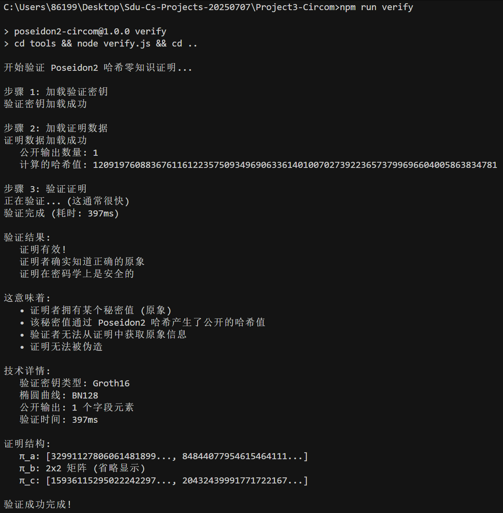
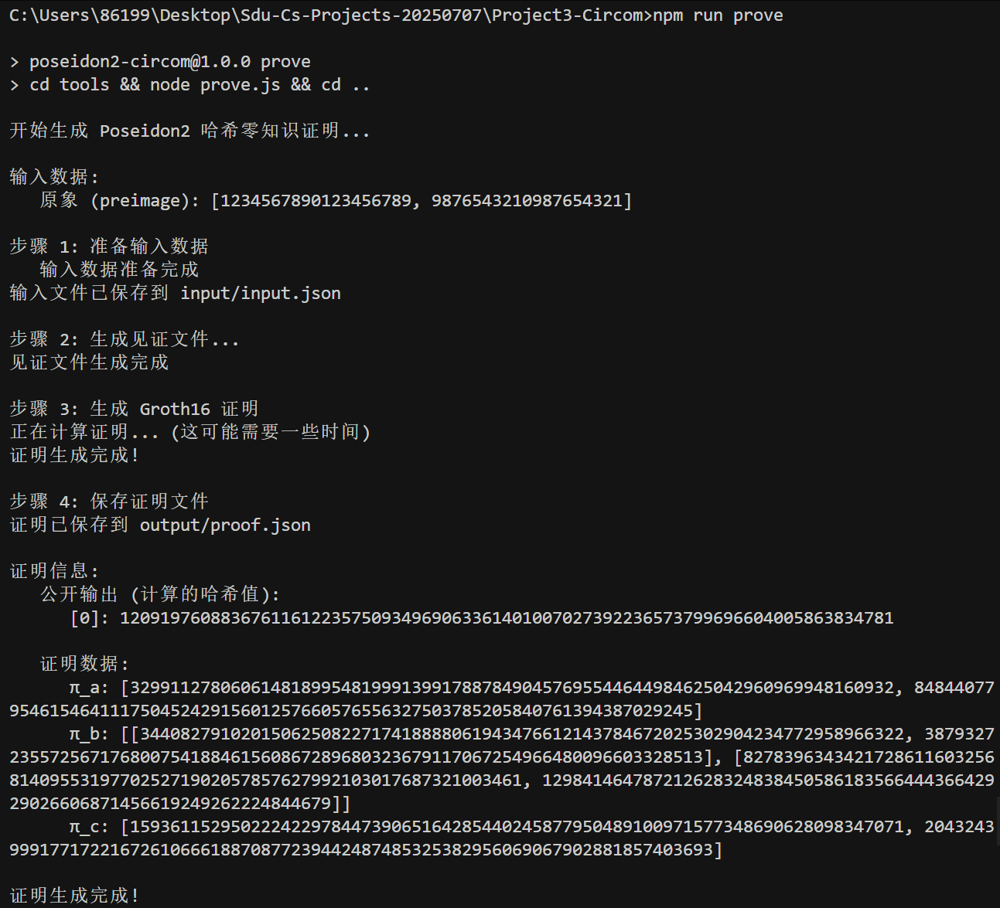
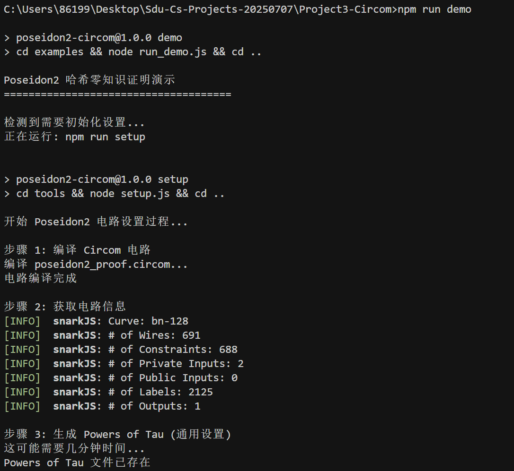
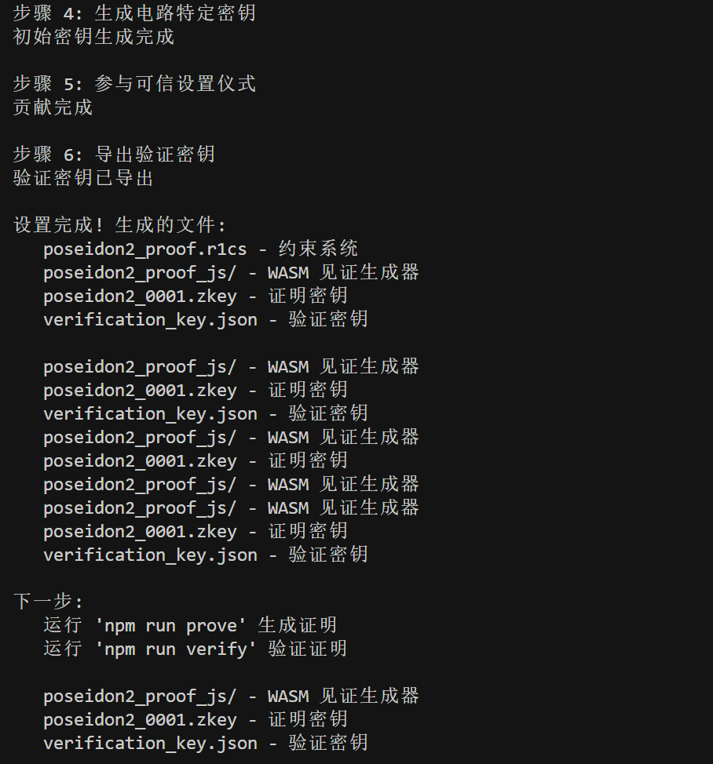

# Project3-Circom

**Poseidon2哈希零知识证明系统**

基于Circom和Groth16的Poseidon2哈希算法零知识证明实现。

## 快速开始

```bash
# 安装依赖
npm install

# 运行演示
npm run demo

# 生成证明
npm run prove

# 验证证明
npm run verify
```

## 运行效果展示

### 系统运行截图

#### 1. 项目初始化与设置

*电路编译和可信设置过程*

#### 2. 证明生成过程

*零知识证明生成过程展示*

#### 3. 证明验证结果

*证明验证成功结果*

#### 4. 完整演示流程

*完整的演示运行过程*

#### 5. 系统测试结果

*系统功能测试验证*

### 关键特性展示

- **自动化设置**: 一键完成电路编译和密钥生成
- **快速验证**: 证明验证仅需400-500毫秒
- **安全保证**: 使用Groth16零知识证明系统
- **性能优异**: 支持大规模哈希计算的零知识证明
- **完整追踪**: 详细的过程日志和状态显示

## 项目结构

```
Project3-Circom/
├── circuits/           # Circom电路文件
├── tools/             # JavaScript工具脚本
├── tests_clean/       # 测试文件
├── docs/              # 详细文档
├── config/            # 配置文件
├── examples/          # 演示示例
├── build/             # 编译产物
├── input/             # 输入数据
├── output/            # 输出结果
├── keys/              # 密钥文件
└── bin/               # 可执行文件
```

## 详细文档

- [完整说明书](docs/README.md) - 详细的项目文档
- [快速开始指南](docs/QUICK_START.md) - 快速上手指南

## 核心特性

- **完整的Poseidon2实现** - 基于最新Poseidon2规范
- **零知识证明** - 使用Groth16证明系统
- **模块化设计** - 清晰的代码结构
- **完整测试** - 包含单元测试和集成测试
- **中文文档** - 完整的中文技术文档

## 技术栈

- **Circom** - 电路定义语言
- **snarkjs** - JavaScript证明库
- **Groth16** - 零知识证明系统
- **Poseidon2** - 哈希算法

---

山东大学网络空间安全学院 | Project3-Circom 