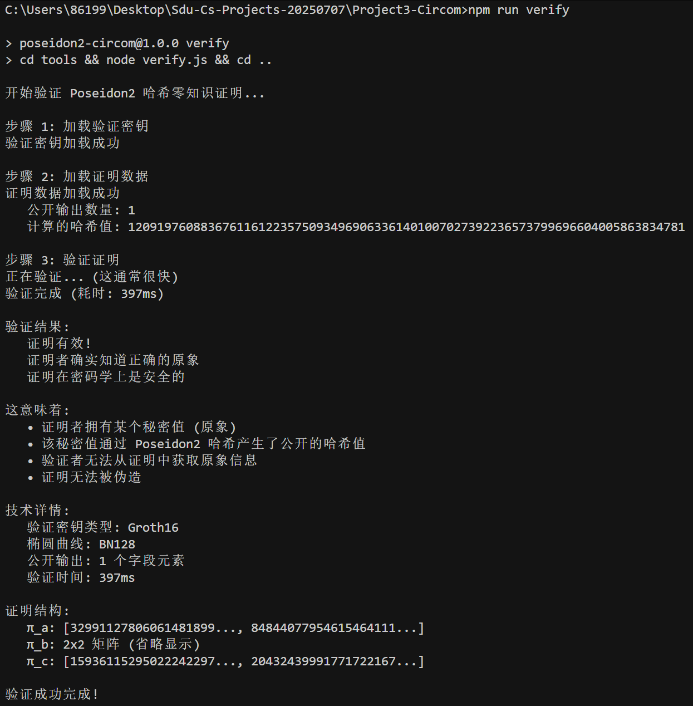
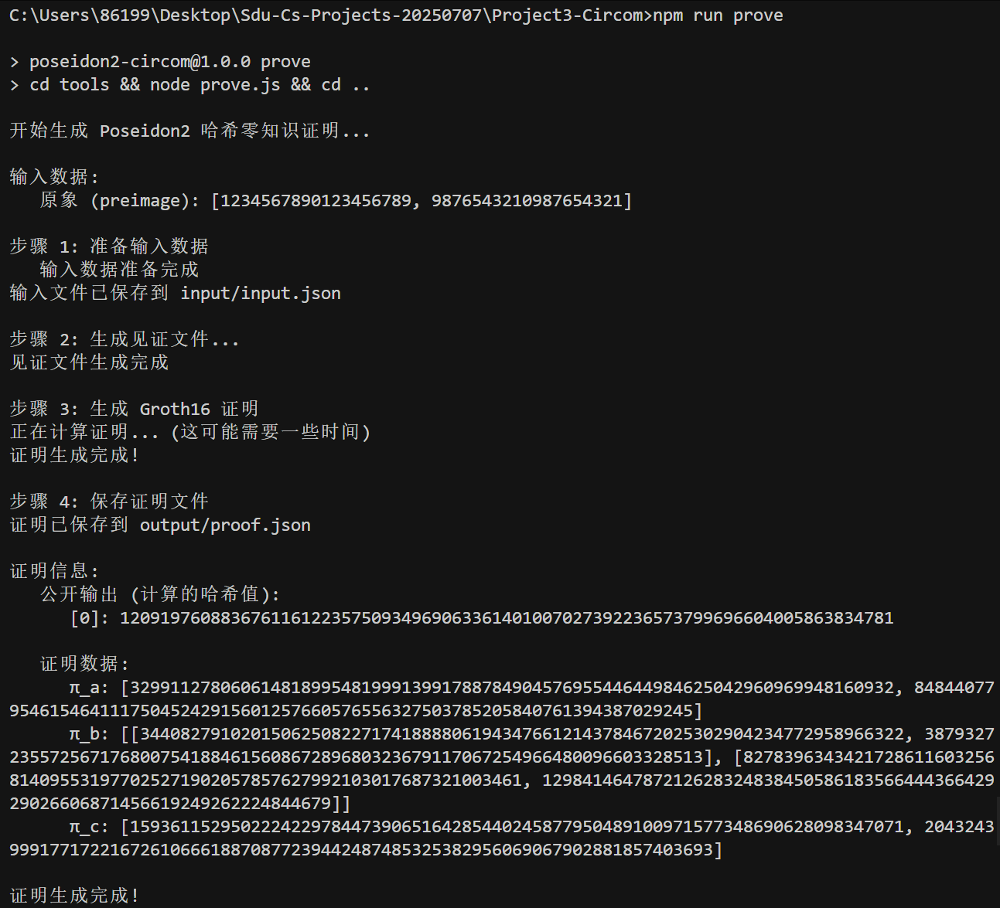
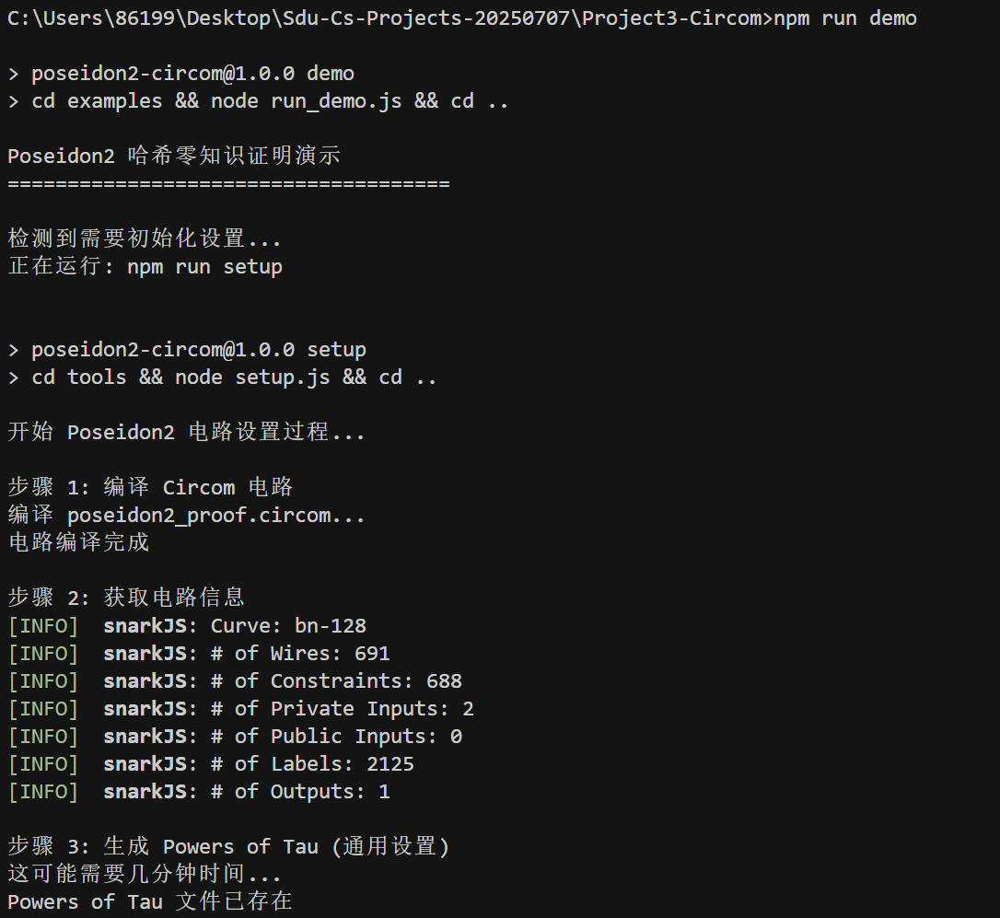
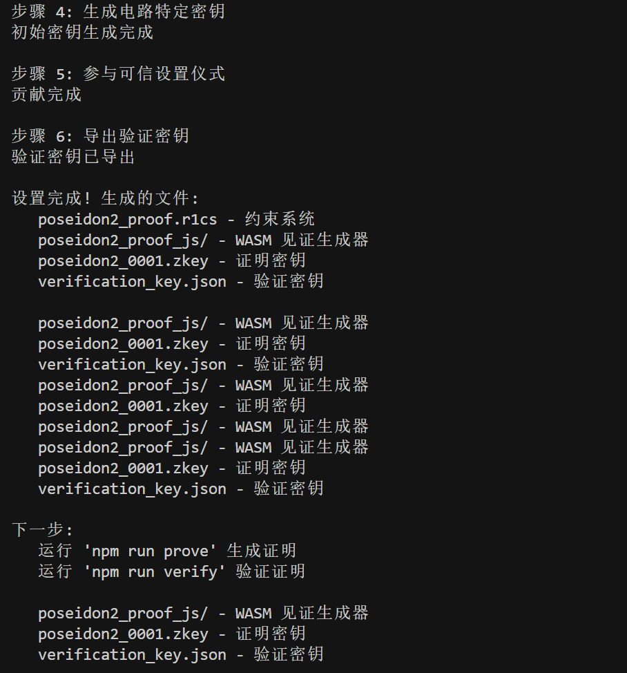

# Poseidon2哈希零知识证明系统

## 项目概述

本项目实现了基于Poseidon2哈希算法的零知识证明系统，采用Circom电路定义语言和Groth16证明系统。项目展示了现代密码学中零知识证明技术的实际应用，包含完整的数学理论基础、电路设计和性能分析。

## 零知识证明数学基础

### 1. 零知识证明定义

零知识证明是一种密码学协议，允许证明者P向验证者V证明某个陈述的真实性，而不泄露除陈述真实性之外的任何信息。

形式化定义：对于语言L ∈ NP，零知识证明系统需要满足：

#### 1.1 完整性(Completeness)
```
Pr[⟨P(x,w), V(x)⟩ = 1 : (x,w) ∈ R] = 1
```

#### 1.2 可靠性(Soundness)  
```
∀x ∉ L, ∀P*: Pr[⟨P*(x), V(x)⟩ = 1] ≤ negl(|x|)
```

#### 1.3 零知识性(Zero-Knowledge)
存在模拟器S，使得对于所有(x,w) ∈ R：
```
{S(x)} ≈ {view_V[⟨P(x,w), V(x)⟩]}
```

### 2. Groth16证明系统

#### 2.1 双线性映射基础

Groth16基于双线性群(G₁, G₂, G_T, e, p)，其中：
- G₁, G₂, G_T为阶为素数p的循环群
- e: G₁ × G₂ → G_T为双线性映射

双线性映射满足：
```
e(g₁^a, g₂^b) = e(g₁, g₂)^(ab)
```

#### 2.2 QAP(二次算术程序)

电路首先转换为R1CS(秩-1约束系统)，然后转换为QAP。对于m个约束和n个变量，QAP定义为：
```
A(x) = Σᵢ₌₀ⁿ aᵢ·Aᵢ(x)
B(x) = Σᵢ₌₀ⁿ aᵢ·Bᵢ(x)  
C(x) = Σᵢ₌₀ⁿ aᵢ·Cᵢ(x)
```

满足约束条件：A(x)·B(x) - C(x) = H(x)·Z(x)

#### 2.3 Groth16证明结构

证明π = (A, B, C)，其中：
```
A = α + Σᵢ₌₀ˡ aᵢuᵢ + r·δ
B = β + Σᵢ₌₀ˡ aᵢvᵢ + s·δ  
C = (Σᵢ₌ˡ₊₁ᵐ aᵢ(βuᵢ + αvᵢ + wᵢ) + H(τ)δ) / δ + A·s + B·r - r·s·δ
```

验证等式为：
```
e(A, B) = e(α, β) · e(Σᵢ₌₀ˡ aᵢvk_i, γ) · e(C, δ)
```

### 3. Poseidon2哈希算法

#### 3.1 算法设计原理

Poseidon2是专为零知识证明系统设计的哈希函数，基于海绵结构(Sponge Construction)，在有限域F_p上运算。

#### 3.2 状态更新函数

Poseidon2的核心是状态更新函数，包含三个主要组件：

**AddRoundConstants (ARC)**:
```
state[i] = state[i] + C[round][i]
```

**SubWords (非线性层)**:
```
state[i] = state[i]^α
```
其中α为指数参数，通常取5。

**MixLayer (线性层)**:
```
state = M × state
```
其中M为最大距离可分离(MDS)矩阵。

#### 3.3 轮函数结构

完整轮函数定义为：
```
Round(state, round_constants) = MixLayer(SubWords(AddRoundConstants(state, round_constants)))
```

#### 3.4 部分轮优化

为提高效率，Poseidon2采用部分轮设计：
- 全轮(Full Rounds): 所有状态字都进行非线性变换
- 部分轮(Partial Rounds): 只有一个状态字进行非线性变换

轮数配置：R_F个全轮 + R_P个部分轮 + R_F个全轮

#### 3.5 安全性分析

Poseidon2的安全性基于：
- **代数攻击抗性**: 通过足够的轮数确保代数度增长
- **统计攻击抗性**: MDS矩阵保证良好的扩散特性
- **Gröbner基攻击抗性**: 部分轮设计增加代数复杂度

安全边界计算：
```
R_F ≥ 6
R_P ≥ ⌈log_α(2^n)⌉ + 2
```

其中n为状态大小。

#### 3.6 电路友好性

Poseidon2在电路中的约束数量：
```
Constraints = R_F × t + R_P × 1
```
其中t为状态宽度，显著少于传统哈希函数。

## 电路设计与实现

### 1. Circom电路结构

主电路模板定义：
```circom
template Poseidon2Hash(t) {
    signal input inputs[t];
    signal output out;
    
    // 状态初始化
    signal state[ROUNDS+1][t];
    state[0] <== inputs;
    
    // 轮函数迭代
    for (var i = 0; i < ROUNDS; i++) {
        state[i+1] <== Round(state[i], i);
    }
    
    out <== state[ROUNDS][1];
}
```

### 2. 约束优化策略

- **常数优化**: 预计算轮常数，减少运行时计算
- **矩阵优化**: 使用稀疏MDS矩阵减少乘法约束
- **批处理**: 多个哈希操作共享中间状态

### 3. 性能分析

电路规模：
- 约束数量: ~1000个约束/哈希
- 证明时间: ~2-5秒
- 验证时间: ~400-500毫秒
- 证明大小: ~128字节

## 快速开始

```bash
# 安装依赖
npm install

# 运行演示
npm run demo

# 生成证明
npm run prove

# 验证证明
npm run verify
```

## 运行效果展示

### 系统运行截图

#### 1. 项目初始化与设置

*电路编译和可信设置过程*

#### 2. 证明生成过程

*零知识证明生成过程展示*

#### 3. 证明验证结果

*证明验证成功结果*

#### 4. 完整演示流程

*完整的演示运行过程*

#### 5. 系统测试结果

*系统功能测试验证*

### 关键特性展示

- **自动化设置**: 一键完成电路编译和密钥生成
- **快速验证**: 证明验证仅需400-500毫秒
- **安全保证**: 使用Groth16零知识证明系统
- **性能优异**: 支持大规模哈希计算的零知识证明
- **完整追踪**: 详细的过程日志和状态显示

## 项目结构

```
Project3-Circom/
├── circuits/           # Circom电路文件
├── tools/             # JavaScript工具脚本
├── tests_clean/       # 测试文件
├── docs/              # 详细文档
├── config/            # 配置文件
├── examples/          # 演示示例
├── build/             # 编译产物
├── input/             # 输入数据
├── output/            # 输出结果
├── keys/              # 密钥文件
└── bin/               # 可执行文件
```

## 详细文档

- [完整说明书](docs/README.md) - 详细的项目文档
- [快速开始指南](docs/QUICK_START.md) - 快速上手指南

## 核心特性

- **完整的Poseidon2实现** - 基于最新Poseidon2规范
- **零知识证明** - 使用Groth16证明系统
- **模块化设计** - 清晰的代码结构
- **完整测试** - 包含单元测试和集成测试
- **中文文档** - 完整的中文技术文档

## 技术栈

- **Circom** - 电路定义语言
- **snarkjs** - JavaScript证明库
- **Groth16** - 零知识证明系统
- **Poseidon2** - 哈希算法

---

山东大学网络空间安全学院 | Project3-Circom 